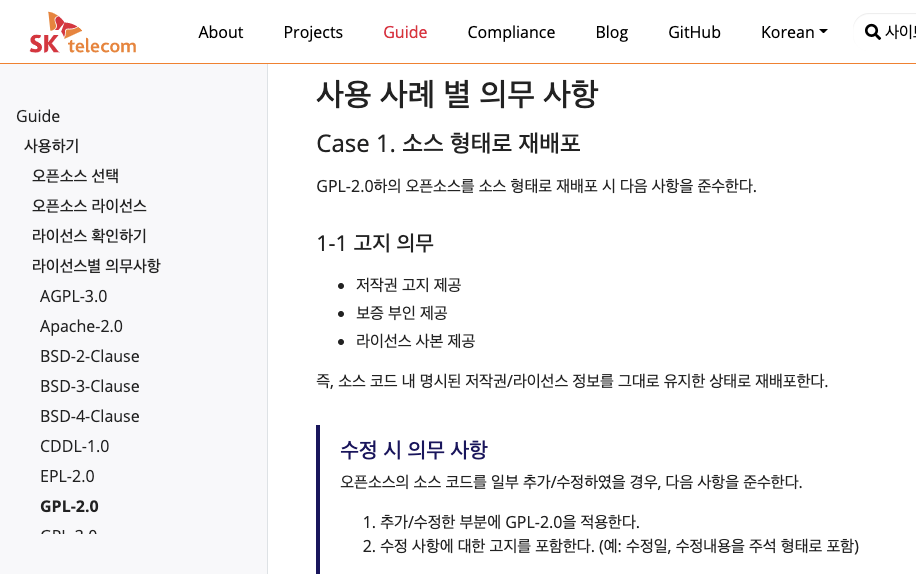
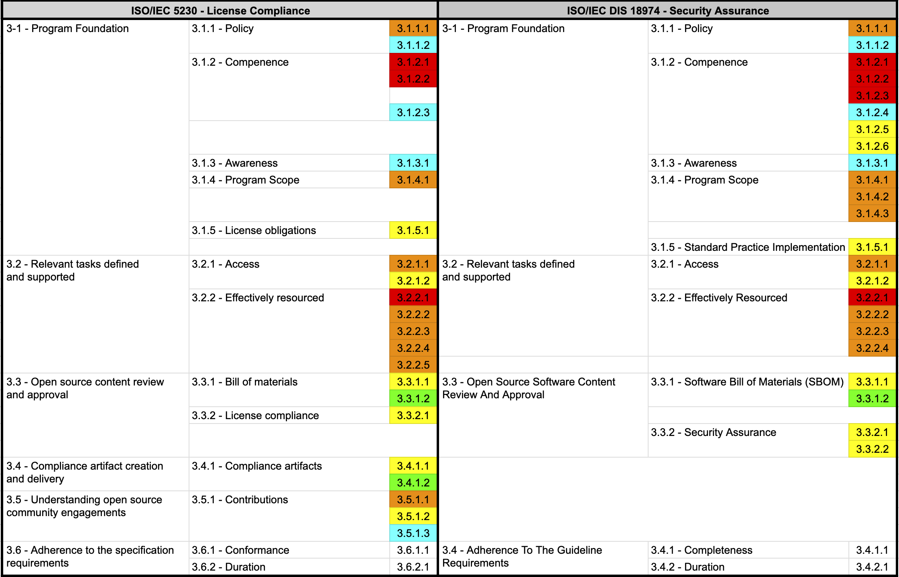

## 1. 교육

아무리 훌륭한 정책과 프로세스를 구축하였다고 해도 기업의 구성원이 아무도 신경쓰지 않는다면 무용지물일 것입니다. 오픈소스 정책과 오픈소스 프로세스가 기업에서 효과적으로 동작하기 위해서는 구성원 교육이 중요합니다.

기업은 모든 프로그램 참여자가 조직 내에 오픈소스 정책이 있다는 것을 인식하고 필요한 활동을 할 수 있도록 교육, 내부 위키 등 실질적인 수단을 제공해야 합니다. 여기서 프로그램 참여자란 기업이 소프트웨어를 개발하고 배포, 기여하는 데 관여하는 모든 직원을 의미하며, 소프트웨어 개발자, 배포 엔지니어, 품질 엔지니어 등을 포함합니다.

이를 위해 ISO 표준은 공통적으로 다음과 같이 오픈소스 정책을 알리기 위한 문서화된 절차를 요구합니다.

{}

* 3.1.1.2 - A documented procedure that makes program participants aware of the existence of the open source policy (e.g., via training, internal wiki, or other practical communication method).<br>`프로그램 참여자가 오픈소스 정책의 존재를 알 수 있게 하는 문서화 된 절차 (교육, 내부 위키, 혹은 기타 실질적인 전달 방법 등)`

{}


{}

* 3.1.1.2: A documented procedure to make Program Participants aware of the Security Assurance policy.<br>`프로그램 참가자에게 보안 보증 정책을 알리기 위한 문서화된 절차.`

{}

많은 기업은 오픈소스 정책 문서를 사내 위키 사이트를 통해 공개하여 직원 누구나 필요한 사항을 확인할 수 있게 합니다. 또한, 신규 채용 인원의 입사 연수 시 오픈소스 정책에 대한 교육을 의무화하고, 프로그램 참여자를 대상으로 매년 혹은 2년에 한 번씩 주기적인 교육을 제공함으로써 모든 프로그램 참여자가 오픈소스 정책의 존재를 인식하게 합니다.

기업은 이러한 방법들을 다음의 예와 같이 작성하여 오픈소스 정책 문서에 포함해야 합니다.

```
5. 교육 및 평가

4장에서 정의한 각 역할을 담당하는 모든 구성원은 [Learning Portal]에서 제공하는 오픈소스 교육 고급 과정을 수강해야 합니다. 이를 통해 오픈소스 정책, 관련 교육 정책 및 조회 방법을 숙지합니다. 교육 이력과 평가 결과는 [Learning Portal]에 최소 3년간 보존합니다.


```

기업은 프로그램 참여자가 기업의 오픈소스 정책, 오픈소스 관련 목표, 효과적인 오픈소스 프로그램이 되기 위한 참여자의 기여 방법, 그리고 프로그램 요구사항을 준수하지 않을 경우 미치는 영향에 대해 인식하도록 해야 합니다. 이를 위해 기업은 교육을 제공하고, 프로그램 참여자가 올바르게 인식하였는지 확인하기 위해 평가를 수행하고 평가 결과를 문서화하여 보관해야 합니다.

ISO 표준은 공통적으로 다음과 같이 프로그램 참여자의 인식을 평가하였음을 나타내는 문서화된 증거를 요구합니다.

{}

* 3.1.3.1 - Documented evidence of assessed awareness for the program participants - which should include the program's objectives, one's contribution within the program, and implications of program non-conformance.<br>`다음 사항에 대한 프로그램 참여자의 인식을 평가하였음을 나타내는 문서화된 증거 : 프로그램의 목표, 프로그램 내에서의 참여자 기여 방법 및 프로그램을 준수하지 않을 경우 미치는 영향`

{}


{}

* 3.1.3.1: Documented Evidence of assessed awareness for the Program Participants - which should include the Program’s objectives, one’s contribution within the Program, and implications of Program non-conformance.<br>`다음 사항에 대한 프로그램 참여자의 인식을 평가하였음을 나타내는 문서화된 증거 : 프로그램의 목표, 프로그램 내에서의 참여자 기여 방법 및 프로그램을 준수하지 않을 경우 미치는 영향.`

{}


따라서 기업은 아래의 예와 같은 내용을 기업의 오픈소스 정책에 포함할 수 있다.

```
1. 목적

(1) 정책의 목적 

이 정책은 OOO 주식회사(이하 "회사"라 함)에서 소프트웨어 개발, 서비스, 배포에 관여하는 전체 조직이 올바르게 오픈소스 소프트웨어(이하 "오픈소스"라 함)를 활용하기 위해 다음과 같은 원칙을 제공합니다.

1. 오픈소스 컴플라이언스 / 보안 보증 원칙
2. 외부 오픈소스 프로젝트로의 기여 원칙
3. 사내 프로젝트를 오픈소스로 공개하기 위한 원칙

이러한 원칙은 회사의 모든 구성원이 오픈소스의 가치를 이해하고, 오픈소스를 올바르게 사용하며, 오픈소스 커뮤니티에 기여하기 위한 방법을 제공합니다.

회사의 모든 구성원은 사내 위키의 다음 링크에서 오픈소스 정책을 확인할 수 있습니다 : [internal_link]

(2) 미준수 시 영향
이 정책을 준수하지 않는다면 다음과 같은 상황이 발생할 수 있습니다.

- 외부로부터 오픈소스 라이선스 준수 요구를 받을 수 있습니다.
- 회사가 개발한 소스 코드를 원치 않게 공개해야 할 수 있습니다.
- 오픈소스 저작권자로부터 법적 소송을 제기당할 수 있습니다.
- 저작권 침해 및 계약 위반으로 벌금을 부과받거나, 제품 판매 중지 명령을 받을 수 있습니다.
- 회사 평판이 손상될 수 있습니다.
- 공급업체와의 계약 위반이 되어 손해배상 청구를 받을 수 있습니다.
- 심각한 보안 사고에 노출되어 회사에 막대한 손해를 입힐 수 있습니다.

이러한 이유로 회사는 오픈소스 정책의 위반을 심각하게 간주하며, 이를 위반하는 구성원이나 조직은 징계 절차에 처할 수 있습니다.

(3) 구성원의 기여 방법

회사의 모든 구성원은 이 정책의 근거와 내용을 이해하고 필요한 활동을 충실히 수행함으로써 정책의 효과 및 회사의 컴플라이언스 수준 향상에 기여할 수 있습니다.

```

평가에 대해서는 아래에서 한번 더 자세히 설명합니다.

오픈소스 교육에는 오픈소스 기여 정책에 대한 내용도 포함됩니다. 오픈소스 기여 정책을 만들었다 해도 사내 구성원이 이에 대한 존재를 알지 못한다면 무분별한 기여 활동으로 개인과 회사에 피해가 발생할 우려가 있습니다.

이를 위해 ISO/IEC 5230 표준은 다음과 같이 모든 프로그램 참여자가 오픈소스 기여 정책의 존재를 인식하도록 하는 문서화된 절차를 요구합니다.

{}

* 3.5.1.3 - A documented procedure that makes all program participants aware of the existence of the open source contribution policy (e.g., via training, internal wiki, or other practical communication method).<br>`모든 프로그램 참여자가 오픈소스 기여 정책의 존재를 인식하도록 하는 문서화된 절차 (예: 교육, 내부 위키, 또는 기타 실질적인 전달 방법 등)`

{}

따라서 기업은 모든 사내 개발자가 오픈소스 기여 정책의 존재를 알 수 있도록 오픈소스 교육을 제공해야 합니다.

교육자료를 새롭게 제작하는 것도 처음 업무를 시작하는 담당자에게는 쉽지 않은 일일 수 있습니다. 이러한 어려움을 돕고자 엔씨소프트는 사내 오픈소스 교육자료를 누구나 사용할 수 있도록 교안(PPT)와 강의 스크립트를 GitHub에 공개했습니다.


<center><i>https://github.com/ncsoft/oss-basic-training</i></center>


또한, 국내 대표 플랫폼 기업인 카카오도 사내 개발자를 위한 오픈소스 교육자료를 누구나 열람할 수 있도록 공개했습니다.



<center><i>http://t1.kakaocdn.net/olive/assets/opensource_guide_kakao.pdf</i></center>


아직 교육 자료를 만들지 않았다면, 이런 오픈소스 관리 우수 기업들의 오픈소스 교육 자료를 활용하는 것도 좋은 방법입니다.

## 2. 평가

기업은 각 역할에 대한 담당자를 지정하였으면, 지정된 담당자가 교육, 훈련 및 경험을 바탕으로 맡은 역할을 수행할 수 있는 자격을 갖추었음을 확인해야 합니다. 역량이 미흡한 프로그램 참여자에게는 충분한 역량을 갖출 수 있도록 교육도 제공해야 합니다. 그리고 기업은 각 참여자가 역량을 갖추고 있는지 평가하고 결과를 보관해야 합니다.

이를 위해 ISO 표준은 공통적으로 다음과 같이 프로그램 참여자의 역량을 평가한 문서화된 증거를 요구합니다.

{}

* 3.1.2.3 - Documented evidence of assessed competence for each program participant.<br>`각 프로그램 참여자의 역량을 평가한 문서화된 증거`

{}


{}

* 3.1.2.4 - Documented evidence of assessed competence for each Program Participant; <br>`각 프로그램 참여자의 역량을 평가한 문서화된 증거`

{}

따라서, 기업은 아래와 같이 교육과 평가를 수행하고 결과를 유지해야 합니다.

1. 기업은 각 참여자가 필요한 역량을 보유할 수 있도록 교육을 제공합니다.
2. 교육 내용을 기반으로 평가를 수행합니다.
3. 평가 결과는 기업의 교육 시스템 혹은 HR 부서에서 보관합니다.

프로그램 참여자가 수백 명 이상이어서 교육 제공이 쉽지 않을 경우, 기업의 온라인 교육과 평가 시스템을 이용하는 것도 좋은 방법입니다.

이와 같은 내용은 기업의 오픈소스 정책에 다음과 같이 포함할 수 있습니다.


```
4. 역할, 책임 및 역량

정책의 효과를 보장하기 위해 다음과 같이 역할과 책임 및 각 역할의 담당자가 갖추어야 할 역량을 정의합니다.

각 역할의 담당 조직/담당자와 필요 역량 수준은 [부록 1. 담당자 현황]에서 정의합니다.


5. 교육 및 평가

4장에서 정의한 각 역할을 담당하는 모든 구성원은 [Learning Portal]에서 제공하는 오픈소스 교육 고급 과정을 수강해야 합니다. 이를 통해 오픈소스 정책, 관련 교육 정책 및 조회 방법을 숙지합니다. 

교육 이력과 평가 결과는 [Learning Portal]에 최소 3년간 보존합니다.


```


## 3. 오픈소스 라이선스 가이드

오픈소스 라이선스를 제대로 준수하기 위해서는 오픈소스 라이선스별로 요구하는 사항에 대해 정확히 알고 있어야 합니다. 하지만 개별 소프트웨어 개발자가 이를 일일이 파악하는 것은 어려우므로, 오픈소스 프로그램 매니저는 자주 사용되는 오픈소스 라이선스에 대해 일반적인 사용 사례별 요구사항/주의사항을 정리하여 회사 내부에 공유하는 것이 좋습니다.

오픈소스 라이선스 가이드에는 일반적인 오픈소스 라이선스 사용 사례별 요건을 포함하여 개발 부서에서 오픈소스를 사용하면서 올바른 라이선스 의무 준수 활동을 할 수 있게 해야 합니다.

이를 위해 ISO/IEC 5230 표준은 다음과 같이 배포용 소프트웨어 내의 오픈소스 컴포넌트에 대해 일반적인 오픈소스 라이선스 사용 사례를 처리하기 위한 문서화된 절차를 요구합니다.

{}

* 3.3.2.1 - A documented procedure for handling the common open source license use cases for the open source components of the supplied software.<br>`배포용 소프트웨어 내의 오픈소스 컴포넌트에 대해 일반적인 오픈소스 라이선스 사용 사례를 처리하기 위한 문서화된 절차`

{}

오픈소스 라이선스 사용 사례를 처리하기 위해서는 오픈소스 라이선스별로 분류된 라이선스 가이드가 필요합니다. 오픈소스 라이선스에 대한 일반적인 가이드와 라이선스 의무 요약 자료는 한국저작권위원회에서 제공하는 [라이선스 가이드](https://www.olis.or.kr/license/licenseGuide.do)를 참고할 수 있습니다.

SK텔레콤의 오픈소스 가이드 내 [라이선스별 의무사항](https://sktelecom.github.io/guide/use/obligation/)항 문서도 좋은 자료입니다.



[https://sktelecom.github.io/guide/use/obligation/gpl-2.0/](https://sktelecom.github.io/guide/use/obligation/gpl-2.0/)

기업은 구성원이 쉽게 접근하여 참고할 수 있는 공간에 오픈소스 라이선스 가이드를 제공해야 합니다.

## 4. Summary

여기까지 교육, 평가와 가이드 제공 환경까지 구축하게 되면 ISO 표준 규격 중 아래의 하늘색으로 표시된 요구사항을 충족할 수 있다.



