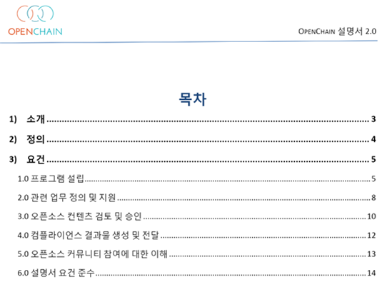

## What is the OpenChain Specification?
 

The OpenChain Specification is a 12-page standard specification that defines key requirements for open source compliance, and is designed to be suitable for companies in all fields regardless of the size or industry of the enterprise. In April 2019, the [OpenChain Specification 2.0](https://wiki.linuxfoundation.org/_media/openchain/openchainspec-2.0.pdf) was released, describing six requirements that companies must perform to achieve open source compliance and defining a list of verification materials that can prove that companies are doing so.

1. Program Foundation
2. Relevant Tasks Defined and Supported
3. Open Source Content Review and Approval
4. Compliance Artifact Creation and Delivery
5. Understanding Open Source Community Engagements
6. Adherence to the Specification Requirements

If you are new to open source compliance, you can improve your level by meeting the requirements of this OpenChain Specification one by one.

## Specification translation policy

In the case of the specification, the OpenChain Project does not adopt the translations made by one individual as an official version. They have a policy that requires translation and supervision by at least two individuals or organizations to ensure that correct translations are released.

For detailed translation policy on OpenChain Specification, refer to the following page. : [https://wiki.linuxfoundation.org/openchain/spec-translations](https://wiki.linuxfoundation.org/openchain/spec-translations)

## Specification translation status

The Korean translation of the OpenChain Specification has been translated up to version 2.0 and can be downloaded from the following page. : [https://github.com/OpenChain-Project/Specification/tree/master/Community/kr/2.0](https://github.com/OpenChain-Project/Specification/tree/master/Community/kr/2.0)

## Specification Contributors

The main contributors to Korean translation of the OpenChain Specification are as follows.

| Name            | Company           | Email | Role |
|-------------------|-----------------|------|------|
| Haksung Jang   | SK telecom  | haksung@sk.com | Maintainer |
| Jongbaek Park  | BKL | jb.park@bkl.co.kr | Contributor | 
| Seo-Young Isabelle Hwang  | Samsung | seoyoung.hwang@samsung.com | Contributor | 
| Jongho Hong  | LG Electronics | jjongho.hong@lge.com | Contributor | 
| Kyoungae Kim  | LG Electronics | kyoungae.kim@lge.com | Contributor | 

## How to join

Specification Korean translation is jointly performed on GitHub, and anyone can participate. Please join!

	<a class="btn btn-lg btn-secondary mr-3 mb-4" href="https://github.com/OpenChain-Project/Specification/tree/master/Community/kr">
		GitHub <i class="fab fa-github ml-2 "></i>
	</a>

