이전 글에서는 기업의 효과적인 오픈소스 관리 방안으로 [글로벌 협력을 위한 OpenChain Project](https://devocean.sk.com/blog/techBoardDetail.do?ID=164676)를 소개했습니다. 이번에는 한국 기업이 오픈소스를 효과적으로 관리하기 위한 협업 커뮤니티인 [OpenChain Korea Work Group](https://openchain-project.github.io/OpenChain-KWG/)에 대해 소개하려고 합니다.

## OpenChain Korea Work Group

[OpenChain Korea Work Group](https://openchain-project.github.io/OpenChain-KWG/)(KWG)은 Linux Foundation의 [OpenChain Project](https://openchainproject.org/)의 하위 그룹입니다. 이 그룹은 오픈소스 정신인 협업과 공유를 통해 모두가 효과적으로 오픈소스 관리에 성공하기 위한 방법을 고민하고 공유하는 모임입니다. KWG에는 한국의 [주요 ICT 기업](https://openchain-project.github.io/OpenChain-KWG/about/member/)의 오픈소스 담당자들이 참여하고 있습니다.

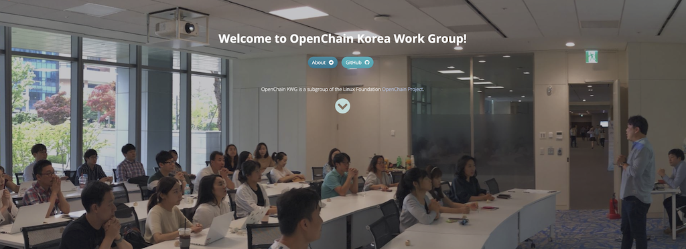

## OpenChain KWG 정기 미팅

오픈소스 관리를 위한 정책과 프로세스를 이미 구축한 대기업들도, 현대의 거대하고 복잡한 소프트웨어 공급망을 고려한다면 오픈소스 라이선스나 보안 취약점 리스크에서 벗어나기 어렵습니다. 결국, 소프트웨어 공급망 내 모든 기업의 오픈소스 관리 수준을 높이는 것이 중요합니다. 이를 위해서는 오픈소스 관리 방법에 대한 이해도가 높은 기업이 먼저 노하우를 공유하고, 다른 기업에서 쉽게 참여할 수 있도록 안내하는 길잡이가 필요합니다.

기업이 보유한 오픈소스 관리 자산을 경쟁사와 공유한다고 해도 매출에 악영향을 끼치지 않습니다. 반면, 경쟁사의 오픈소스 관리 정책을 알아내더라도 이를 기업의 이익과 연결할 수 없습니다. 기업들이 서로 오픈소스 관리 Best Practice를 공유한다면, 각 기업은 적은 비용과 리소스 투입으로도 큰 효과를 얻을 수 있습니다. 이러한 아이디어에 공감하여, LG전자, SK텔레콤, 카카오, 현대자동차, 삼성전자의 오픈소스 담당자들이 참여한 첫 번째 [OpenChain KWG 모임](https://openchain-project.github.io/OpenChain-KWG/meeting/)이 2019년 1월에 개최되었습니다. 

## 17차 미팅 (오프라인)

모임은 매 분기 진행하고 있으며, 코로나 기간 동안 온라인으로 진행되었습니다. 그러다가, 지난 2023년 3월 28일에는 3년 만에 [오프라인 모임을 개최](https://openchain-project.github.io/OpenChain-KWG/meeting/17th/)했습니다. 19개 기업/기관에서 50여 명의 오픈소스 담당자가 참석했습니다. 이번 오프라인 모임은 라인플러스에서 준비해 주었습니다. 쾌적한 장소와 음료, 그리고 기념품 등을 제공해주신 라인플러스의 오픈소스 매니저 [이서연](https://engineering.linecorp.com/ko/blog/line-opensource-manager-interview), 김동혁 님께 감사드립니다! ^^ 

이번 모임의 첫 번째 부분에서는 OpenChain Project의 국내외 최신 동향과 보안 보증 규격에 대한 발표가 있었으며, AI 기술에 대한 법적 이슈 및 사례 연구에 대한 발표도 있었습니다. 두 번째 부분에서는 기업의 오픈 소스 관리를 위한 도구를 오픈 소스로 개발하여 공유하는 세션 발표가 있었습니다. 자세한 발표 내용은 이어지는 소개에서 다루겠습니다.

## 1부 : 세션 발표

### OpenChain Global Updat (Linux Foundation, Shane Coughlan)

Linux Foundation의 OpenChain Project General Manager [Shane Coughlan](https://jp.linkedin.com/in/shanecoughlan)은 직접 참석하여 [OpenChain Project의 Global Trend](https://openchain-project.github.io/OpenChain-KWG/meeting/17th/global-updates-public.pdf)를 소개했습니다.

오픈소스 컴플라이언스를 위한 표준인 ISO/IEC 5230뿐만 아니라 보안을 위한 표준인 [ISO/IEC DIS 18974](https://www.iso.org/standard/86450.html)도 개발 중입니다. 이 표준은 곧 공식 ISO 표준으로 등록될 예정이며, 기업이 준수해야 할 [Self-Checklist](https://github.com/OpenChain-Project/Reference-Material/blob/master/Self-Certification/Checklist/DIS-18974/en/DIS-18974-Self-Certification-Checklist-2.0.md)도 공개되어 있습니다. 이러한 자료들을 활용하여 기업은 효율적인 오픈소스 리스크 관리를 수행할 수 있습니다.

Shane은 KWG 멤버들을 위한 기념품도 가져와서 큰 호응을 얻기도 하였습니다. (Thank you, Shane 😊 )

### OpenChain 보안 표준 소개 (SK텔레콤, 장학성)

[ISO/IEC 5230](https://www.iso.org/standard/81039.html)은 오픈소스 컴플라이언스를 위한 국제 표준입니다. 이 표준은 2020년에 ISO에 등록되었으며, 세계의 [많은 기업이 이 표준을 준수](https://www.openchainproject.org/community-of-conformance)하여 오픈소스 컴플라이언스 관리를 훌륭하게 수행하고 있습니다. 기업이 오픈소스를 관리해야 하는 이유는 라이선스 컴플라이언스 뿐만 아니라 보안 취약점에 대한 리스크도 존재하기 때문입니다. OpenChain Project에서는 보안 취약점 관리를 위한 표준, [ISO/IEC DIS 18974](https://www.iso.org/standard/86450.html), OpenChain security assurance specification을 만들었습니다. 저는 이 표준이 어떤 내용으로 구성되어 있는지를 [간단히 요약하여 소개](https://openchain-project.github.io/OpenChain-KWG/meeting/17th/OpenChain%EB%B3%B4%EC%95%88%EB%B3%B4%EC%A6%9D%EA%B7%9C%EA%B2%A9%EC%86%8C%EA%B0%9C_20230328_%EC%9E%A5%ED%95%99%EC%84%B1.pdf)하였습니다. 

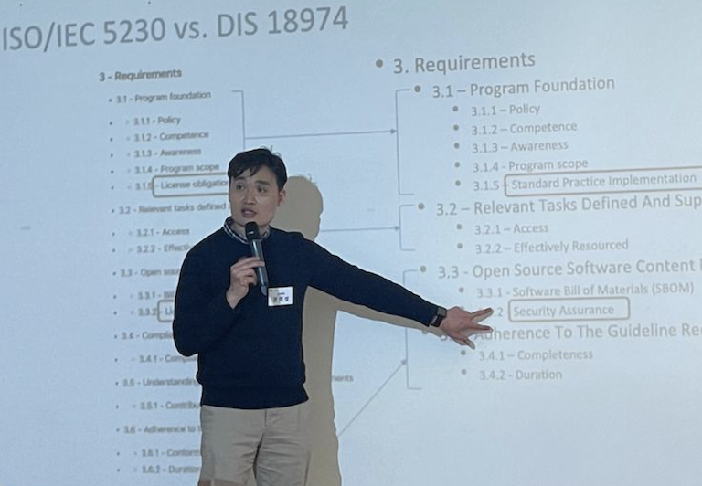

이 보안 표준은 ISO/IEC 5230과 동일한 포맷으로 구성되어 있습니다. 라이선스 컴플라이언스 대신 보안 취약점 관리를 위해 수행해야 할 요구 사항을 정의합니다. 기업은 라이선스 컴플라이언스 이외에도 보안 취약점 관리를 위한 정책과 프로세스를 구축해야 합니다. 또한, 발견된 보안 취약점에 대응할 수 있는 절차를 마련해야 합니다.

### Legal Issues of AI Technologies / Case Study: Getty Images v. Stability AI (ETRI 박정숙)

ETRI의 박정숙 님은 최근 제기된 Stable Diffusion 관련 소송을 분석하여 AI 법률 이슈를 소개하였습니다. 발표 자료는 [여기](https://openchain-project.github.io/OpenChain-KWG/meeting/17th/OpenChain-KWG_2023%EB%85%843%EC%9B%94_ETRI_%EB%B0%95%EC%A0%95%EC%88%99.pdf)에서 확인할 수 있습니다. 

박정숙님은 AI 관련 법률 제정 현황을 분석하고, 이를 기반으로 AI 관련 오픈소스 컴플라이언스 대응 방안을 모색하여 공유해주셨습니다.

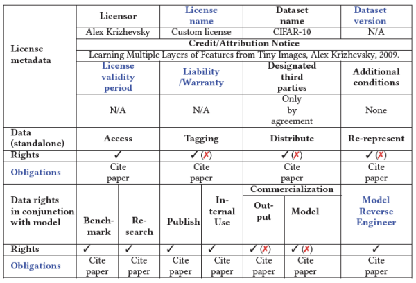

## 2부 : Mini Summit - 오픈소스 관리 자동화 도구

2부에서는 오픈소스 관리를 자동화하기 위한 각 기업의 Best Practice를 공유하는 세션 발표가 있었습니다. 

### 도구 별 의존성 분석 방식 (카카오, 임현지)

카카오 임현지님은 오픈소스 분석 도구의 의존성 분석 방식을 비교 분석하여 발표하셨습니다. 발표 자료는 [여기](https://openchain-project.github.io/OpenChain-KWG/meeting/17th/%EB%8F%84%EA%B5%AC%EB%B3%84_%EC%9D%98%EC%A1%B4%EC%84%B1_%EB%B6%84%EC%84%9D_%EB%B0%A9%EC%8B%9D.pdf)에서 확인할 수 있습니다.

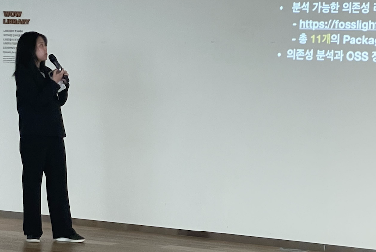

대표적인 오픈소스 분석 도구인 FOSSA, FOSSLight, ORT (OSS Review Toolkit), OLIVE Platform 별로 의존성 분석 방식을 파악하여 공유하였습니다. 

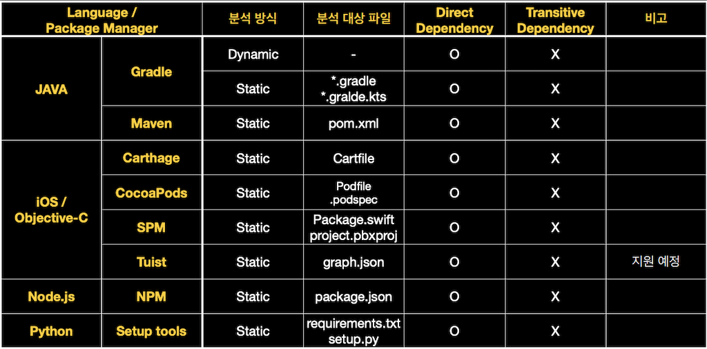

### 소리소리 OSORI (LG전자, 김소임)

LG전자 김소임님은 OSORI 프로젝트에 대해 소개하는 [세션 발표](https://openchain-project.github.io/OpenChain-KWG/meeting/17th/230328_History_of_OSORI_%EB%B0%9C%ED%91%9C%EC%9A%A9.pdf)를 하였습니다. 

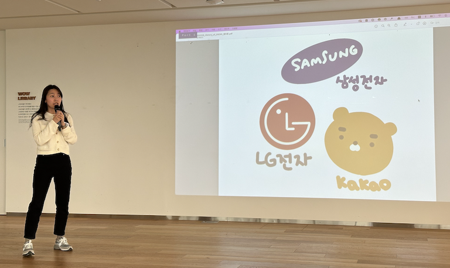

OSORI는 오픈소스 정보 데이터를 공개하여 누구나 쉽게 오픈소스 정보를 확인하고 필요한 의무 사항을 준수할 수 있게 하기 위한 오픈소스 프로젝트입니다. LG전자, 삼성전자, 카카오가 보유한 오픈소스 프로젝트에 대한 주요 정보, 라이선스 종류, 이에 따른 주요 준수 사항 및 제약 사항을 항목별로 테이블을 구성한 정보를 데이터베이스화하기 위한 스키마를 정의하였고, 앞으로 데이터 정제, 운영 Policy 정립, 가이드 페이지 구축 등의 로드맵을 소개하였습니다.

### FOSSLight Roadmap (LG전자, 김경애)

[FOSSLight](https://fosslight.org/)는 LG전자에서 자체 개발하여 사용하고 있는 오픈소스 관리 통합 시스템을 누구나 사용할 수 있도록 [2021년 오픈소스로 공개](https://live.lge.co.kr/lg-fosslight/)한 프로젝트입니다. LG전자의 김경애 님은 2023년 [FOSSLight Roadmap](https://openchain-project.github.io/OpenChain-KWG/meeting/17th/230328_FOSSLight_2023_%EB%A1%9C%EB%93%9C%EB%A7%B5_%EA%B3%B5%EC%9C%A0.pdf)을 소개하였습니다. 

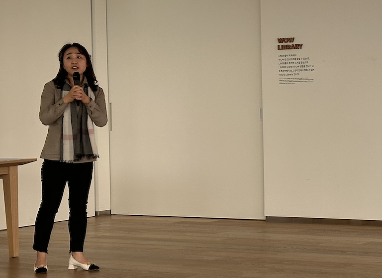

FOSSLight Project는 2023년 보안 취약점 기능을 개선하고, SBOM 기능 강화, UX개선 등의 로드맵을 가지고 있습니다. 

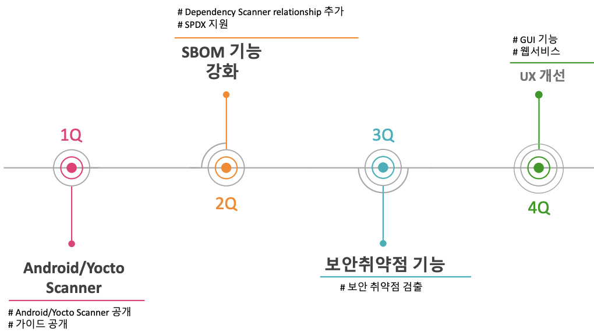

### 요즘 OLIVE 써봤니? (카카오, 황은경)

[OLIVE Platform](https://olive.kakao.com/)은 카카오에서 개발한 오픈소스 라이선스 검증 서비스이며, 카카오 계정만 있으면 누구나 무료로 사용할 수 있습니다. 카카오의 황은경 님은 OLIVE Platform의 주요 기능을 소개하였습니다. 

OLIVE Platform은 소스 코드 노출이 우려되는 경우에도 안심하고 사용할 수 있는 OLIVE CLI 기능이 추가되어 보안에 민감한 금융권에서도 도입될 수 있었습니다. 

### onot, 이제 제법 쓸만해졌어요! (카카오, 한현민)

[onot](https://github.com/sktelecom/onot)은 SK텔레콤과 카카오가 공동 개발한 오픈소스 프로젝트 입니다. [SPDX](https://spdx.org/) 규격으로 작성된 SBOM을 오픈소스 고지문으로 자동 변환하는 도구입니다. 카카오의 한현민 님은 최근 onot에 추가된 신규 기능에 대해 소개하였습니다. 발표 자료는 [여기](https://openchain-project.github.io/OpenChain-KWG/meeting/17th/openchain_kwg_17th_onot.pdf)에서 확인할 수 있습니다. 

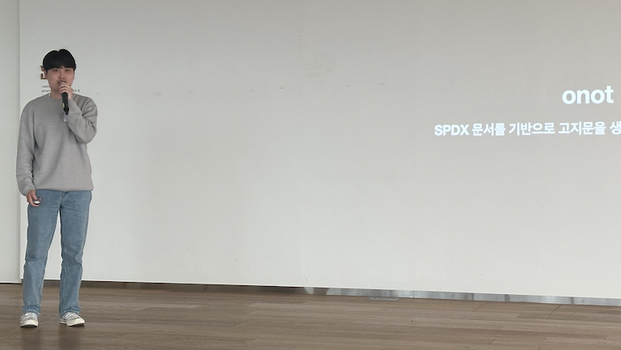

onot은 Package 정보뿐만 아니라 File 정보도 추출하게 되었고, Multi License 표기도 지원하게 되었습니다. RDF/xml 형태의 SPDX 문서도 오픈소스 고지문을 생성할 수 있으며, 특히 Windows PC에서의 GUI와 같은 보다 편리한 사용 환경을 지원하게 되었습니다. 

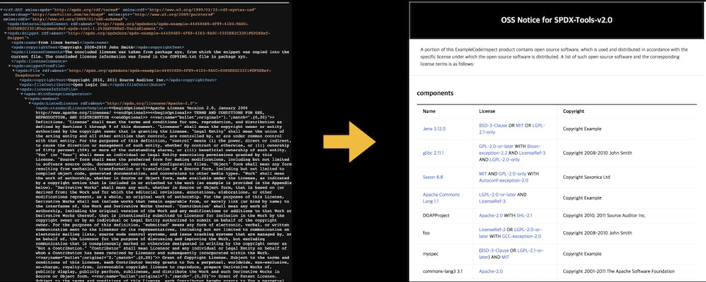

## 글을 마치며

3년여만에 오프라인으로 모인 모임은 짧은 시간이 아쉬울 정도로 알찼습니다. 멋진 장소와 기념품, 추첨 상품까지 준비해준 라인플러스 이서연 님, 김동혁 님께 다시 한번 감사드립니다. 

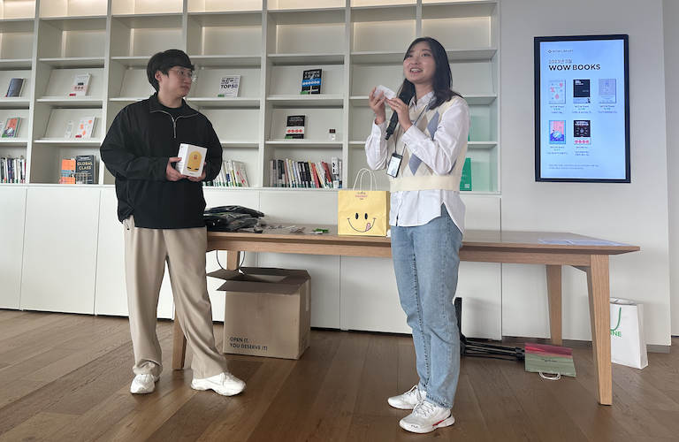

기업들은 오픈소스 관리 업무에서 비슷한 어려움을 겪게 되는데, 이를 어떻게 극복하고 효율화하였는지를 공유하는 것은 서로에게 큰 도움이 됩니다. OpenChain Korea Work Group은 이러한 공감을 갖는 기업의 담당자가 자발적으로 참여하는 모임입니다. OpenChain Korea Work Group은 기업/기관에서 오픈소스 관리 업무를 담당하시는 누구나 참여할 수 있습니다. : [가입 방법](https://openchain-project.github.io/OpenChain-KWG/about/subscribe/)

끝으로, OpenChain KWG는 분기마다 정기 미팅을 개최하고 있습니다. 다음 모임은 카카오에서 만날 수 있을 것 같습니다. 

그때까지 모두 행복하세요! 😃