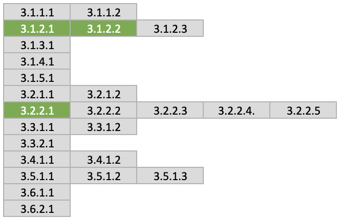

## 역할과 책임 정의

기업의 오픈소스 거버넌스 체계를 구축하기 위해서는 먼저 이를 책임지고 수행할 책임자가 필요하다. 오픈소스 프로그램 매니저, 오픈소스 컴플라이언스 담당자 등의 명칭으로 불릴 수 있으며, 이 책임자는 기업의 오픈소스 컴플라이언스에 대한 총괄 책임을 담당한다. 

아래의 역량을 가지고 있다면 이 역할에 적합하다고 할 수 있겠다. 

- 오픈소스 생태계에 대한 이해 및 개발 경험
- 기업의 비즈니스에 대한 폭넓은 이해
- 기업의 구성원에게 효과적인 오픈소스 활용을 전파할 수 있는 열정과 커뮤니케이션 능력

오픈소스 프로그램 매니저는 가능한 풀타임으로 역할을 수행할 수 있도록 보장되는게 좋다. 

글로벌 ICT 기업은 이와 같은 우수한 오픈소스 프로그램 매니저를 채용하기 위해 노력하고 있으며, 다음 사이트에서는 다양한 채용 공고를 확인할 수 있다. : [https://github.com/todogroup/job-descriptions](https://github.com/todogroup/job-descriptions)

기업은 오픈소스 거버넌스 체계를 구축하기 위해 각 역할의 필요성을 정의하고, 어떠한 책임을 할당하여야 하는가를 판단해야 한다. 소규모 기업의 경우, 오픈소스 프로그램 매니저 혼자서 모든 역할을 수행하는 것도 가능하다. 기업의 규모에 따라 오픈소스 도구를 운영하는 IT 담당자도 필요할 수 있고, 전문적인 법무 자문을 제공하기 위한 법무 담당의 역할이 요구될 수도 있다. 

일반적으로 기업의 오픈소스 거버넌스 체계 구축을 위해서는 아래의 역할이 필요하다. 

- 법무 담당
- IT 담당
- 개발 문화 담당
- 보안 담당



<i>Individuals and teams involved in ensuring open source compliance : https://www.linuxfoundation.org/wp-content/uploads/OpenSourceComplianceHandbook_2018_2ndEdition_DigitalEdition.pdf</i>



이와 같이 수행한다면 ISO/IEC 5230에서 요구하는 다음 입증 자료를 준비할 수 있다.

{}

* <b>3.1.2.1 프로그램의 여러 참여자에 대한 역할과 각 역할의 책임을 나열한 문서</b>

{}

| 자체 인증 1.c  | 프로그램의 성능과 효과에 영향을 미치는 역할과 그에 상응하는 책임을 확인했습니까? |
|---|:---|
|  | Have you identified the roles and the corresponding responsibilities that affect the performance and effectiveness of the Program? |

## 필요 역량 정의

각 역할과 그에 대한 책임을 정의하였다면 그 역할을 수행할 인원이 갖춰야 할 필요 역량이 무엇인지 파악해야 한다. 이를 통해 역할별 담당자에게 해당 역할을 수행할 수 있는 역량을 갖췄는지 평가하고, 필요시 교육을 제공해야 하기 때문이다. 

이와 같이 수행한다면 ISO/IEC 5230에서 요구하는 다음 입증 자료를 준비할 수 있다.

{}

* <b>3.1.2.2 각 역할을 위해 필요한 역량을 기술한 문서</b>

{}

| 자체 인증 1.d  | 각 역할에 필요한 역량을 확인하고 문서화했습니까? |
|---|:---|
|  | Have you identified and documented the competencies required for each role? |

## 담당자 지정

오픈소스 프로그램 매니저는 관련부서와 협의하여 각 역할을 위한 담당자를 지정하고 이를 문서화한다.  물론 이를 위해서는 CEO 등 최고 의사결정권자에게 오픈소스 컴플라언스 체계 구축을 위한 목표와 방향을 보고하여 필요한 지원을 받아야 할 것이다. 

오픈소스 관련 조직과 담당자는 반드시 풀타임으로 오픈소스 업무에 참여할 필요는 없다. OSRB (Open Source Review Board) 형태의 Virtual한 조직을 구성하여 필요한 역할을 수행하면 된다. 

SK텔레콤은 OSRB를 구성하여 기업 내 오픈소스 정책과 프로세스를 만들고, 이슈 발생 시 대응 방안을 마련하고 있다. 



<i>https://sktelecom.github.io/about/osrb/</i>



이와 같이 수행한다면 ISO/IEC 5230에서 요구하는 다음 입증 자료를 준비할 수 있다.

{}

* <b>3.2.2.1 프로그램 내 각 역할을 담당하는 인원, 그룹 또는 직무의 이름을 기재한 문서</b>

{}

| 자체 인증 2.d  | 프로그램 내 각 역할을 담당하는 인원, 그룹 또는 직무의 이름을 기재한 문서가 있습니까? |
|---|:---|
|  | Have you documented the persons, group or function supporting the Program role(s) identified? |

아래의 테이블은 오픈소스 관련 조직과 담당자의 역할 및 요구되는 필요 역량을 명시한 샘플 담당자 현황이다. 기업은 이를 참고하여 오픈소스 조직을 구성하여 문서화할 수 있다. 

이 내용은 다음 페이지에서도 확인할 수 있다. : [https://haksungjang.github.io/docs/openchain/#appendix-1-담당자-현황](https://haksungjang.github.io/docs/openchain/#appendix-1-%EB%8B%B4%EB%8B%B9%EC%9E%90-%ED%98%84%ED%99%A9)

이렇게 조직을 구성하면 ISO/IEC 5230의 요구 사항 중 아래와 같이 세가지 요구사항을 충족하게 된다. 

