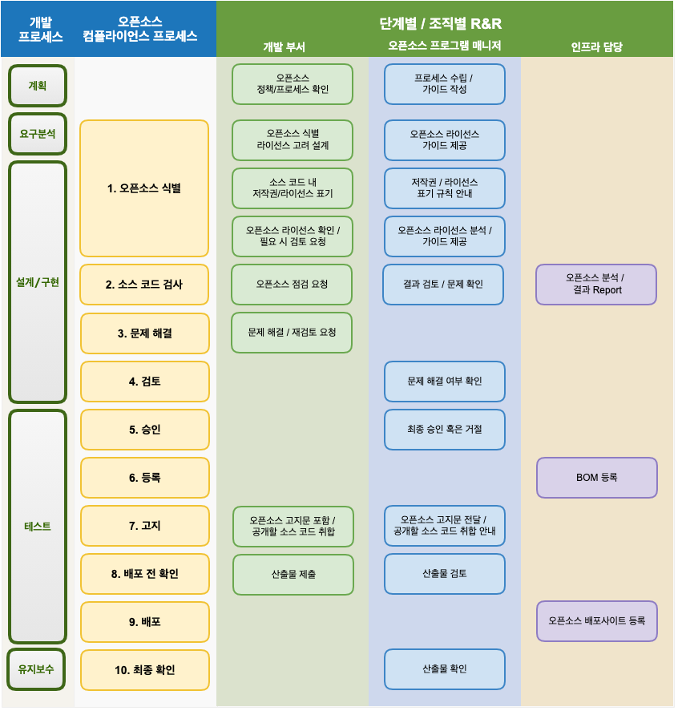
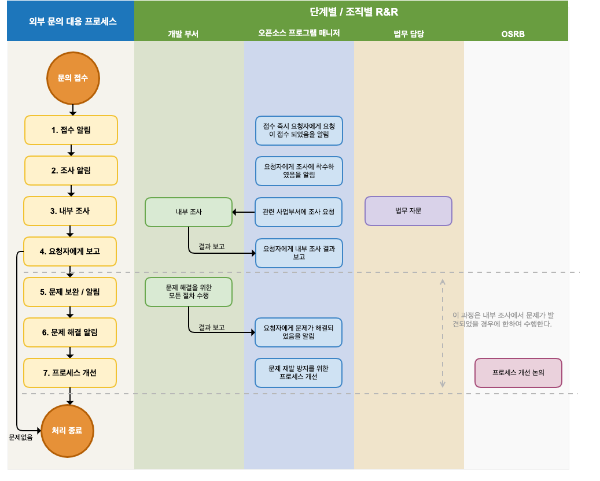
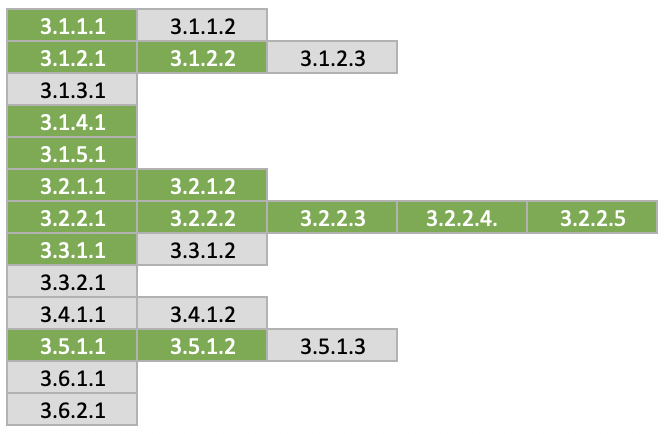

프로세스는 소프트웨어 개발 / 배포 과정에서 기업이 오픈소스 정책을 준수할 수 있게 하는 실행 가능한 절차이다. 오픈소스 컴플라이언스 프로세스는 간단히 말해 소프트웨어를 개발하고 배포하면서 사용한 오픈소스에 대해 각 라이선스가 요구하는 조건을 준수하기 위한 활동이고, 오픈소스 고지문(Notice), 공개할 소스 코드 (Source Code) 등의 산출물을 생성하게 된다. 



<center><i>Simplified view of the compliance end-to-end process : https://www.linuxfoundation.org/wp-content/uploads/OpenSourceComplianceHandbook_2018_2ndEdition_DigitalEdition.pdf</i></center>



오픈소스 컴플라이언스 프로세스를 세분화하여 도식화하면 아래 그림과 같다. 



<center><i>End-to-end compliance process : https://www.linuxfoundation.org/wp-content/uploads/OpenSourceComplianceHandbook_2018_2ndEdition_DigitalEdition.pdf</i></center>


아래의 이미지는 기업이 일반적으로 채택하여 사용할 수 있는 샘플 오픈소스 컴플라이언스 프로세스이다.



이에 대한 자세한 내용은 다음 페이지를 참고할 수 있다. : [https://haksungjang.github.io/docs/openchain/#부록-2-샘플-오픈소스-컴플라이언스-프로세스](https://haksungjang.github.io/docs/openchain/#%EB%B6%80%EB%A1%9D-2-%EC%83%98%ED%94%8C-%EC%98%A4%ED%94%88%EC%86%8C%EC%8A%A4-%EC%BB%B4%ED%94%8C%EB%9D%BC%EC%9D%B4%EC%96%B8%EC%8A%A4-%ED%94%84%EB%A1%9C%EC%84%B8%EC%8A%A4)

이 장에서는 오픈소스 컴플라이언스 프로세스가 포함해야 할 구성 요소에 대해 설명한다. 

## 오픈소스 식별 및 검사

오픈소스의 사용 가능 여부를 판단하기 위해서는 먼저 사용하려는 오픈소스의 라이선스가 무엇인지 식별하고, 라이선스가 요구하는 의무사항을 확인해야 한다. 오픈소스를 사용하였는지, 라이선스는 무엇인지, 각 라이선스가 부여하는 의무는 무엇인지 검토하고 기록해야 한다. 이를 위한 절차의 예는 다음과 같다.

1. 개발 부서는 오픈소스 정책에서 정의한 기준에 따라 라이선스를 예비 평가한다.
2. 의문 사항은 오픈소스 프로그램 매니저에게 문의하고, 필요할 경우 오픈소스 프로그램 매니저는 외부 법률 전문가에게 자문을 요청한다.
3. 모든 내외부의 결정 결과 및 관련 근거는 보관한다.

“[부록 2. 샘플 오픈소스 컴플라이언스 프로세스](https://haksungjang.github.io/docs/openchain/#%EB%B6%80%EB%A1%9D-2-%EC%83%98%ED%94%8C-%EC%98%A4%ED%94%88%EC%86%8C%EC%8A%A4-%EC%BB%B4%ED%94%8C%EB%9D%BC%EC%9D%B4%EC%96%B8%EC%8A%A4-%ED%94%84%EB%A1%9C%EC%84%B8%EC%8A%A4)”의 [1. 오픈소스 식별](https://haksungjang.github.io/docs/openchain/#1-%EC%98%A4%ED%94%88%EC%86%8C%EC%8A%A4-%EC%8B%9D%EB%B3%84subidentification-of-open-sourcesub), 검사, 문제 해결, 리뷰, 승인 단계는 각 식별된 라이선스가 부가하는 의무, 제한을 검토하고 기록하기 위한 문서화된 절차의 한 예이다. 


이와 같은 절차를 마련한다면 ISO/IEC 5230에서 요구하는 다음 입증 자료를 준비할 수 있다.

{}

* <b>3.1.5.1 각 식별된 라이선스에 의해 부여된 의무, 제한 및 권리를 검토하고 기록하기 위한 문서화된 절차</b>

{}

| 자체 인증 1.i  | 오픈소스 라이선스 의무, 제한 및 권리를 검토하는 프로세스가 있습니까? |
|---|:---|
|  | Do you have a process for reviewing open source license obligations, restrictions and rights? |

오픈소스 식별 및 검사 단계에서는 소스 코드 스캔 도구를 사용할 수 있다. 이에 대한 자세한 내용은 "[6. 도구](../6-tool/)"에서 설명한다. 

## 오픈소스 BOM 식별, 검토, 보관

오픈소스 컴플라이언스 활동의 가장 기본은 배포용 소프트웨어에 포함된 오픈소스 현황을 파악하는 것이다. 배포용 소프트웨어에 포함된 오픈소스와 그 라이선스를 식별하여 그 정보를 담고 있는 BOM(Bill of Materials)을 작성하고 관리하는 프로세스를 구축해야 한다. 배포용 소프트웨어의 버전마다 어떤 오픈소스가 포함되어 있는지 알고 있어야 소프트웨어를 배포할 때 각 오픈소스의 라이선스가 요구하는 의무 사항을 준수할 수 있기 때문이다.

모든 오픈소스는 배포용 소프트웨어에 통합하기 전에 검토 및 승인되어야 한다. 오픈소스의 기능, 품질뿐만 아니라 출처, 라이선스 요건을 충족할 수 있는지 사전 검토가 되어야 한다. 이를 위해 검토 요청 → 리뷰 → 승인 과정이 필요하다. [부록 2. 샘플 오픈소스 컴플라이언스 프로세스](https://haksungjang.github.io/docs/openchain/#%EB%B6%80%EB%A1%9D-2-%EC%83%98%ED%94%8C-%EC%98%A4%ED%94%88%EC%86%8C%EC%8A%A4-%EC%BB%B4%ED%94%8C%EB%9D%BC%EC%9D%B4%EC%96%B8%EC%8A%A4-%ED%94%84%EB%A1%9C%EC%84%B8%EC%8A%A4)에서는 기업의 오픈소스 컴플라이언스를 위한 프로세스 모든 과정에 관해 설명하고 있다. [1. 오픈소스 식별](https://haksungjang.github.io/docs/openchain/#1-%EC%98%A4%ED%94%88%EC%86%8C%EC%8A%A4-%EC%8B%9D%EB%B3%84subidentification-of-open-sourcesub)부터 [6. 등록](https://haksungjang.github.io/docs/openchain/#6-%EB%93%B1%EB%A1%9Dsubregistrationsub)까지의 과정을 통해 BOM을 작성하고 관리하게 된다.

오픈소스 BOM 관리를 위한 도구에 대해서는 "[6. 도구](../6-tool/)"에서 자세히 설명한다. 

또 이와 같은 오픈소스 컴플라이언스 프로세스의 모든 과정과 결과는 문서화가 되어야 한다. 이메일을 사용하는 것보다는 [Jira](https://www.atlassian.com/software/jira), [Bugzilla](https://www.bugzilla.org/) 등의 이슈 트래킹 시스템을 이용하는 것이 이러한 과정을 효율적으로 문서화 할 수 있다.

이와 같은 절차를 마련한다면 ISO/IEC 5230에서 요구하는 다음 입증 자료를 준비할 수 있다.

{}

* <b>3.3.1.1 배포용 소프트웨어를 구성하는 오픈소스 컴포넌트에 대한 정보를 식별, 추적, 검토, 승인 및 보관하는 문서화된 절차</b>

{}

| 자체 인증 3.a  | 배포용 소프트웨어를 구성하는 오픈소스 컴포넌트에 대한 정보를 식별, 추적, 검토, 승인 및 보관하는 문서화된 절차가 있습니까? |
|---|:---|
|  | Do you have a documented procedure for identifying, tracking and archiving information about the collection of open source components from which a Supplied Software release is comprised? |

## 오픈소스 컴플라이언스 산출물 생성

위에서 오픈소스 컴플라이언스 활동의 가장 기본은 배포용 소프트웨어에 포함된 오픈소스 현황을 파악하는 것이라고 하였다. 이는 바로 오픈소스 컴플라이언스의 핵심인 오픈소스 라이선스 요구사항을 올바르게 충족하기 위해서이다. 즉, 배포용 소프트웨어에 포함된 오픈소스에 대한 컴플라이언스 산출물 세트를 생성하는 프로세스가 구축되어야 한다.

컴플라이언스 산출물은 크게 두 가지로 구분된다.

1. 오픈소스 고지문 : 오픈소스 라이선스 전문과 저작권 정보 제공을 위한 문서

    

    * 도구를 활용하여 취합한 오픈소스 BOM에 해당하는 오픈소스 고지문을 생성하는 방법에 대해 "[6. 도구](../6-tool/)"에서 추가로 설명한다. 

2. 공개할 소스 코드 패키지 : GPL, LGPL 등 소스 코드 공개를 요구하는 오픈소스 라이선스 의무 이행을 위해 공개할 소스 코드를 취합한 패키지

컴플라이언스 산출물은 배포용 소프트웨어를 배포할 때 함께 제공해야 한다. “[부록 2. 샘플 오픈소스 컴플라이언스 프로세스](https://haksungjang.github.io/docs/openchain/#%EB%B6%80%EB%A1%9D-2-%EC%83%98%ED%94%8C-%EC%98%A4%ED%94%88%EC%86%8C%EC%8A%A4-%EC%BB%B4%ED%94%8C%EB%9D%BC%EC%9D%B4%EC%96%B8%EC%8A%A4-%ED%94%84%EB%A1%9C%EC%84%B8%EC%8A%A4)”의 고지 단계부터 배포 단계를 통해 컴플라이언스 산출물을 생성하여 배포한다.

배포용 소프트웨어를 배포 시, 공개할 소스 코드 패키지를 동봉하는 것이 곤란할 경우, 최소 3년간 소스 코드를 제공하겠다는 서면 약정서(Written Offer)를 제공하는 것으로 대신할 수 있다. 일반적으로 서면 약정서는 제품의 사용자 매뉴얼을 통해 제공하며, 예시는 다음과 같다.

```
The software included in this product contains copyrighted software 
that is licensed under the GPL. A copy of that license is included 
in this document on page X. You may obtain the complete Corresponding 
Source code from us for a period of three years after our last shipment 
of this product, which will be no earlier than 2011-08- 01, by sending 
a money order or check for $5 to:

GPL Compliance Division
Our Company
Any Town, US 99999

Please write“source for product Y” in the memo line of your payment.
You may also find a copy of the source at http://www.example.com/sources/Y/.
This offer is valid to anyone in receipt of this information.

<출처 : SFLC Guide to GPL Compliance>
```

따라서, 컴플라이언스 산출물은 3년 이상 보관해야 하며 이를 위한 프로세스가 구축되어야 한다. 이를 위해 기업은 오픈소스 웹사이트 구축을 고려해야 하며, 이에 대한 자세한 내용은 "[6. 도구](../6-tool/)"에서 설명한다. 

이와 같은 절차를 마련한다면 ISO/IEC 5230에서 요구하는 다음 입증 자료를 준비할 수 있다.

{}

* <b>3.4.1.1 식별된 라이선스가 요구하는 컴플라이언스 산출물을 준비하고, 이를 배포용 소프트웨어와 함께 제공하기 위한 프로세스를 설명하는 문서화된 절차</b>

{}

| 자체 인증 4.a  | 식별된 라이선스가 요구하는 컴플라이언스 산출물을 준비하고, 이를 배포용 소프트웨어와 함께 제공하기 위한 프로세스를 설명하는 문서화된 절차가 있습니까? |
|---|:---|
|  | Do you have a documented procedure that describes a process that ensures the Compliance Artifacts are distributed with Supplied Software as required by the Identified Licenses? |

## 외부 문의 대응

기업이 외부 클레임에 의해 법적 소송까지 당하지 않기 위해서는 외부 문의 및 요청에 가능한 빠르고 정확하게 대응하는 것이 중요하다. 이를 위해 기업은 외부 오픈소스 문의를 빠르고 효과적으로 대응 할 수 있는 프로세스를 갖추고 있어야 한다.

아래 그림은 외부 문의 대응을 위해 기업이 갖춰야할 프로세스이다. 


[https://haksungjang.github.io/docs/openchain/#2-외부-문의-대응-프로세스](https://haksungjang.github.io/docs/openchain/#2-%EC%99%B8%EB%B6%80-%EB%AC%B8%EC%9D%98-%EB%8C%80%EC%9D%91-%ED%94%84%EB%A1%9C%EC%84%B8%EC%8A%A4)

[“부록 2. 샘플 오픈소스 컴플라이언스 프로세스의 2. 외부 문의 대응 프로세스](https://haksungjang.github.io/docs/openchain/#2-%EC%99%B8%EB%B6%80-%EB%AC%B8%EC%9D%98-%EB%8C%80%EC%9D%91-%ED%94%84%EB%A1%9C%EC%84%B8%EC%8A%A4)”에서 세부 내용을 확인할 수 있다.

이와 같은 절차를 마련한다면 ISO/IEC 5230에서 요구하는 다음 입증 자료를 준비할 수 있다.

{}

* <b>3.2.1.2 제 3자의 오픈소스 라이선스 컴플라이언스 문의에 대응하기 위한 내부의 문서화된 절차</b>

{}

| 자체 인증 2.c  | 오픈소스 컴플라이언스 문의를 받고 대응하기 위한 책임을 할당하는 문서화된 절차가 있습니까? |
|---|:---|
|  | Do you have a documented procedure that assigns responsibility for receiving and responding to open source compliance inquiries? |

## 오픈소스 기여 프로세스

기업이 외부 오픈소스 프로젝트에 기여를 허용하는 정책을 갖고 있다면, 사내 개발자들이 어떤 절차로 외부 프로젝트에 기여할 수 있을지 관리하는 문서화된 절차가 있어야 한다. 

SK텔레콤에서 공개한 [오픈소스 기여 절차](https://sktelecom.github.io/guide/contribute/process/)는 좋은 예이다.


[https://sktelecom.github.io/guide/contribute/process/](https://sktelecom.github.io/guide/contribute/process/)


이와 같은 절차를 마련한다면 ISO/IEC 5230에서 요구하는 다음 입증 자료를 준비할 수 있다.

{}

* <b>3.5.1.2 오픈소스 기여를 관리하는 문서화된 절차</b>

{}

| 자체 인증 5.b  | 오픈소스 기여를 관리하는 문서화된 절차가 있습니까? |
|---|:---|
|  | Do you have a documented procedure that governs Open Source contributions? |

여기까지 프로세스를 구축하게 되면 ISO/IEC 5230 요구사항을 아래와 같이 준수하게 된다. 



