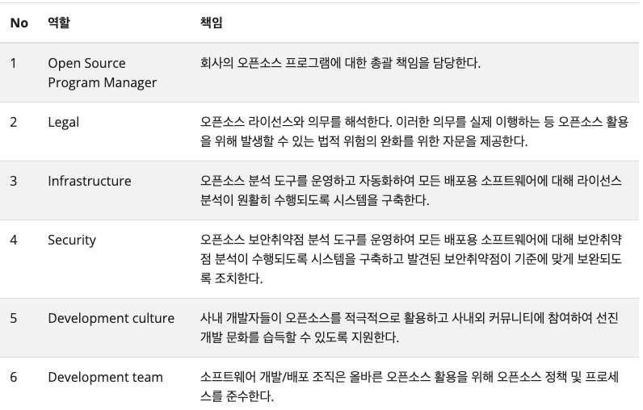
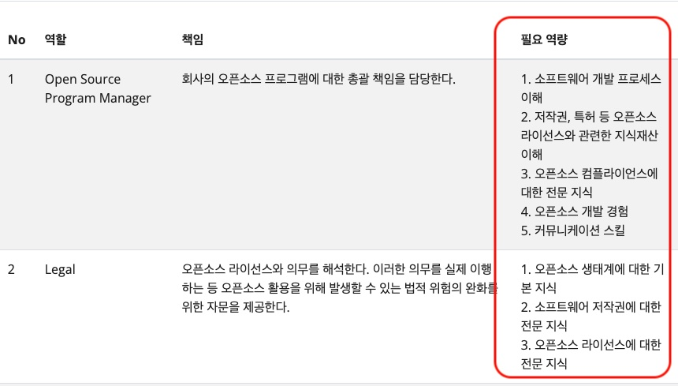
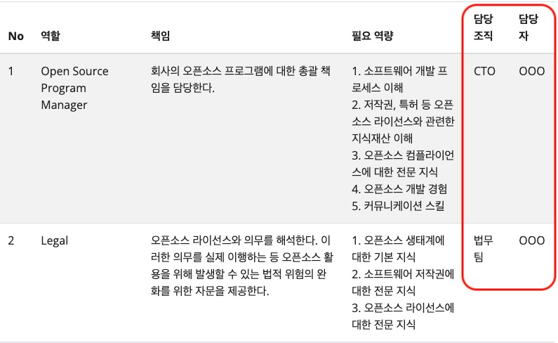
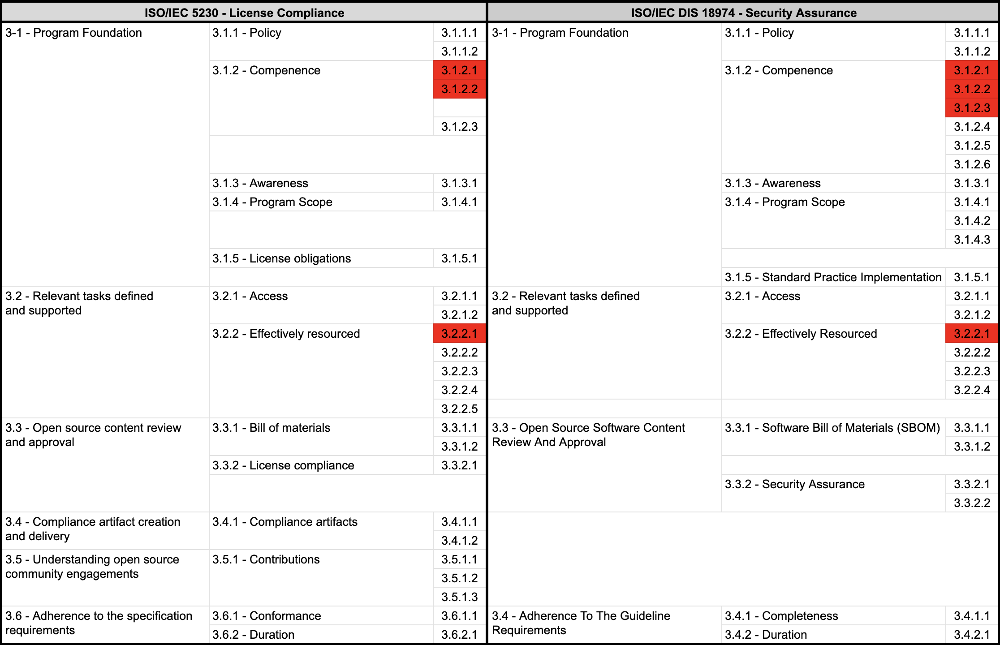

먼저 기업은 오픈소스 관리 업무를 시작할 담당자(조직)를 임명해야 한다. 그에 앞서 담당자의 역할과 책임을 명확히하고 필요 역량을 정의해야 한다. 

## 1. 역할과 책임 정의

기업의 오픈소스 거버넌스 체계를 구축하기 위해서는 먼저 이를 책임지고 수행할 책임자가 필요하다. 오픈소스 프로그램 매니저, 오픈소스 컴플라이언스 담당자 등의 명칭으로 불릴 수 있다. 여기서는 오픈소스 프로그램 매니저라는 용어를 사용하겠다. 오픈소스 프로그램 매니저는 기업의 오픈소스 프로그램 오피스(*오픈소스 프로그램 오피스란 기업의 오픈소스 관리를 위한 조직을 말하며 오픈소스 사무국이란 용어로도 쓰인다.)를 담당한다. 

오픈소스 프로그램 매니저는 아래의 역량을 가지고 있다면 이 역할에 적합하다고 할 수 있겠다. 

- 오픈소스 생태계에 대한 이해 및 개발 경험
- 기업의 비즈니스에 대한 폭넓은 이해
- 기업의 구성원에게 효과적인 오픈소스 활용을 전파할 수 있는 열정과 커뮤니케이션 능력

오픈소스 프로그램 매니저는 가능한 풀타임으로 역할을 수행할 수 있도록 보장되는게 좋다. 

글로벌 ICT 기업은 이와 같은 우수한 오픈소스 프로그램 매니저를 채용하기 위해 노력하고 있으며, 다음 사이트에서는 다양한 채용 공고를 확인할 수 있다. : [https://github.com/todogroup/job-descriptions](https://github.com/todogroup/job-descriptions)

기업은 오픈소스 프로그램 오피스에 필요한 각 역할을 정의하고, 어떠한 책임을 부여해야 하는가를 판단해야 한다. 소규모 기업의 경우, 오픈소스 프로그램 매니저 혼자서 모든 역할을 수행하는 것도 가능하다. 기업의 규모에 따라 오픈소스 도구를 운영하는 IT 담당자도 필요할 수 있고, 전문적인 법무 자문을 제공하기 위한 법무 담당의 역할이 요구될 수도 있다. 

일반적으로 기업의 오픈소스 거버넌스 체계 구축을 위해서는 아래의 역할이 필요하다. 

- 법무 담당
- IT 담당
- 개발 문화 담당
- 보안 담당



<i>Individuals and teams involved in ensuring open source compliance : https://www.linuxfoundation.org/wp-content/uploads/OpenSourceComplianceHandbook_2018_2ndEdition_DigitalEdition.pdf</i>



이를 위해 ISO 표준은 공통적으로 다음과 같이 프로그램의 여러 참여자의 역할과 각 역할의 책임을 나열한 문서를 요구한다. 

{}

* 3.1.2.1 - A documented list of roles with corresponding responsibilities for the different participants in the program. 

{}

{}

* 3.1.2.1: A documented list of roles with corresponding responsibilities for the different Program Participants

{}

따라서 기업은 아래와 같이 오픈소스 프로그램 오피스를 구성하는 역할과 책임을 문서화해야 한다. 

<i><샘플> 역활과 책임 문서화</i>
 

## 2. 필요 역량 정의

각 역할과 그에 대한 책임을 정의하였다면 그 역할을 수행할 인원이 갖춰야 할 필요 역량이 무엇인지 파악해야 한다. 이를 통해 역할별 담당자에게 해당 역할을 수행할 수 있는 역량을 갖췄는지 평가하고, 필요시 교육을 제공해야 하기 때문이다. 

이를 위해 ISO 표준은 공통적으로 다음과 같이 각 역할을 위해 필요한 역량을 기술한 문서를 요구한다. 

{}

* 3.1.2.2 - A document that identifies the competencies for each role.

{}

{}

* 3.1.2.2: A document that identifies the competencies for each role

{}

따라서 기업은 아래와 같이 각 역할을 위해 필요한 역량을 기술하여 문서화해야 한다. 

<i><샘플> 역할 별 필요 역량</i>
 

## 3. 담당자 지정

오픈소스 프로그램 매니저는 관련부서와 협의하여 각 역할을 위한 담당자를 지정하고 이를 문서화한다.  물론 이를 위해서는 CEO 등 최고 의사결정권자에게 오픈소스 컴플라언스 체계 구축을 위한 목표와 방향을 보고하여 필요한 지원을 받아야 할 것이다. 

오픈소스 관련 조직과 담당자는 반드시 풀타임으로 오픈소스 업무에 참여할 필요는 없다. OSRB (Open Source Review Board) 형태의 Virtual한 조직을 구성하여 필요한 역할을 수행하면 된다. 

이를 위해 ISO 표준은 공통적으로 다음과 같이 프로그램 내 각 역할을 담당하는 인원, 그룹 또는 직무의 이름을 기재한 문서를 요구한다. 

{}

* 3.2.2.1 - Document with name of persons, group or function in program role(s) identified.

{}

{}

* 3.1.2.3: List of participants and their roles;
* 3.2.2.1: Document with name of persons, group or function in Program role(s) identified;

{}

따라서 기업은 아래와 같이 프로그램 내 각 역할을 담당하는 인원, 그룹 또는 직무의 이름을 문서화해야 한다. 

<i><샘플> 담당자 지정</i>
 

SK텔레콤은 [OSRB](https://sktelecom.github.io/about/osrb/)를 구성하여 기업 내 오픈소스 정책과 프로세스를 만들고, 이슈 발생 시 대응 방안을 마련하고 있다. 



<i>https://sktelecom.github.io/about/osrb/</i>



## 4. Summary

이렇게 역할, 책임, 필요역량 및 담당자 지정을 문서화한 샘플은 Appendix 1. 오픈소스 정책에서 확인할 수 있다. : 담당자 현황

기업은 이를 참고하여 기업의 상황에 맞게 오픈소스 프로그램 오피스를 구성하여 문서화 하면 된다. 

이렇게 오픈소스 프로그램 오피스 조직을 지정하고 문서화하면, ISO 표준 규격 중 아래의 녹색으로 표시된 요구사항을 충족할 수 있다. 

사실 문서화하는게 중요하다기 보다는 실제 업무를 충실히 수행할 담당자를 지정하고, 담당자가 역량을 확보할 수 있도록 지원하는게 중요하다. 

한국저작권위원회의 [오픈소스 라이선스 전문 교육](https://www.olis.or.kr/consulting/openswStudyDetail.do?seq=463)이나 [NIPA의 공개소프트웨어 매니지먼트 아카데미](https://www.oss.kr/oss_data/show/448d2e96-6819-45f4-b114-73cd41b3e9d3)에 참여하여 체계적인 교육을 수강하는 것도 대단히 도움이 된다. 
