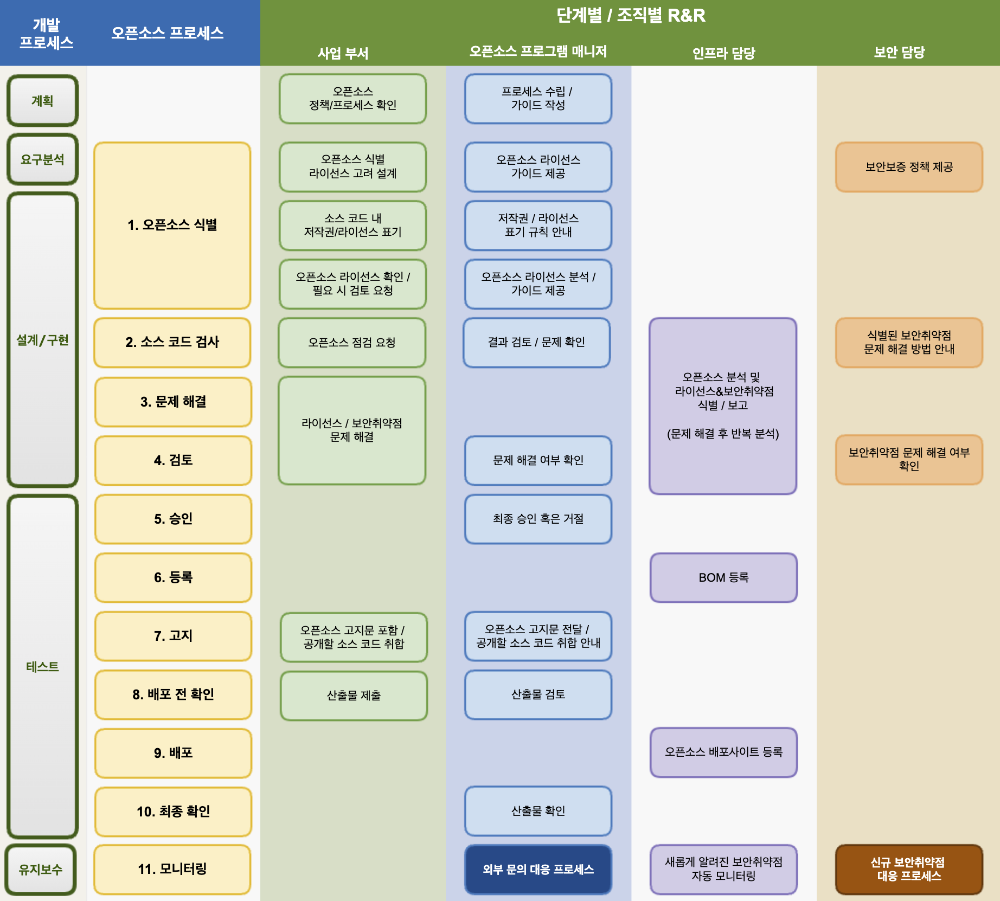

오픈소스 프로세스는 소프트웨어 개발 / 배포 과정에서 기업이 오픈소스 정책을 준수할 수 있게 하는 실행 가능한 절차이다. 오픈소스 컴플라이언스 측면에서는 소프트웨어를 개발하고 배포하면서 사용한 오픈소스에 대해 각 라이선스가 요구하는 조건을 준수하기 위한 활동을 수행하여 오픈소스 고지문(Notice), 공개할 소스 코드 (Source Code) 등의 산출물을 생성하게 된다. 

<center><i>Simplified view of the compliance end-to-end process : https://www.linuxfoundation.org/wp-content/uploads/OpenSourceComplianceHandbook_2018_2ndEdition_DigitalEdition.pdf</i></center>


오픈소스 보안 보증을 위해서는 배포용 소프트웨어에 대한 보안 취약점 존재 여부를 탐지하고 구조적 / 기술적 위협을 식별하여 출시 전에 문제를 해결하기 위한 활동을 수행해야 한다. 

아래의 이미지는 기업이 일반적으로 채택하여 사용할 수 있는 샘플 오픈소스 프로세스이다.

 


그럼 오픈소스 프로세스가 어떻게 구성되어야 하는지 하나하나 살펴보자. 

## 1. 오픈소스 프로세스 

### (1) 오픈소스 식별 및 검사

먼저 사용하려는 오픈소스의 라이선스가 무엇인지 식별하고, 라이선스가 요구하는 의무사항은 무엇인지, 알려진 취약점은 존재하는지 확인해야 한다. 어떤 오픈소스를 사용하려고 하는지, 그 라이선스는 무엇인지, 각 라이선스가 부여하는 의무는 무엇인지, 알려진 취약점은 무엇인지 검토하고 기록해야 한다. 

이를 위해 ISO/IEC 5230 표준은 다음과 같이 라이선스 컴플라이언스를 위해 일반적인 오픈소스 라이선스의 사용 사례를 다룰 수 있어야 하고, 각 식별된 라이선스에 의해 부여된 의무, 제한 및 권리를 검토하고 기록하기 위한 문서화된 절차를 요구한다. 

{}

* 3.3.2.1 - A documented procedure for handling the common open source license use cases for the open source components of the supplied software.
  
* 3.1.5.1 - A documented procedure to review and document the obligations, restrictions and rights granted by each identified license.

{}

이를 위한 절차의 예는 다음과 같다. 

1. 오픈소스 프로그램 매니저는 주요 오픈소스 라이선스 의무, 제한, 권리에 대한 가이드를 작성하여 제공한다. 이 가이드에는 일반적인 오픈소스 라이선스의 사용 사례가 관리될 수 있도록 다음과 같은 사용 사례가 포함되어야 한다. 
   - 바이너리 형태로 배포
   - 소스 형태로 배포
   - 추가 라이선스 의무를 유발하는 다른 오픈소스와 통합
   - 수정된 오픈소스 포함
2. 사업 부서는 오픈소스 정책에서 정의한 기준에 따라 라이선스와 알려진 취약점을 확인한다.
3. 사업 부서는 의문 사항을 오픈소스 프로그램 매니저에게 문의하고, 필요할 경우 오픈소스 프로그램 매니저는 외부 법률 전문가에게 자문을 요청한다.
4. 모든 내외부의 결정 결과 및 관련 근거는 보관한다.

이를 위해 기업은 아래의 예시와 같이 제품 출시 전에 오픈소스 식별, 검사 단계를 통해 각 식별된 라이선스가 부가하는 의무, 제한을 검토하고 기록하기 위한 문서화된 절차를 수립해야 한다. 

“[부록 2. 샘플 오픈소스 프로세스](https://haksungjang.github.io/docs/openchain/#%EB%B6%80%EB%A1%9D-2-%EC%83%98%ED%94%8C-%EC%98%A4%ED%94%88%EC%86%8C%EC%8A%A4-%EC%BB%B4%ED%94%8C%EB%9D%BC%EC%9D%B4%EC%96%B8%EC%8A%A4-%ED%94%84%EB%A1%9C%EC%84%B8%EC%8A%A4)”의 [1. 오픈소스 식별](https://haksungjang.github.io/docs/openchain/#1-%EC%98%A4%ED%94%88%EC%86%8C%EC%8A%A4-%EC%8B%9D%EB%B3%84subidentification-of-open-sourcesub)


<center><i>오픈소스 식별 단계 (샘플)</i></center><br>

오픈소스 식별 및 검사 단계에서는 소스 코드 스캔 도구를 사용할 수 있다. 이에 대한 자세한 내용은 "[6. 도구](../6-tool/)"에서 설명한다. 

### (2) 문제 해결

오픈소스 식별 및 검사를 통해 오픈소스를 식별하고 라이선스와 보안취약점 리스크까지 확인 한 후에는 문제를 해결하는 절차가 필요하다. 다음과 같은 방법으로 검출된 문제를 모두 해결해야 한다. 
- 이슈가 되는 오픈소스를 삭제한다. 
- 라이선스 이슈라면, 다른 라이선스 하의 오픈소스료 교체한다.
- 보안취약점 이슈라면, 알려진 취약점이 수정된 버전으로 교체한다. 

[부록 2. 샘플 오픈소스 프로세스](https://haksungjang.github.io/docs/openchain/#%EB%B6%80%EB%A1%9D-2-%EC%83%98%ED%94%8C-%EC%98%A4%ED%94%88%EC%86%8C%EC%8A%A4-%EC%BB%B4%ED%94%8C%EB%9D%BC%EC%9D%B4%EC%96%B8%EC%8A%A4-%ED%94%84%EB%A1%9C%EC%84%B8%EC%8A%A4)의 문제 해결 단계를 통해 발견된 모든 문제를 해결한다. 

### (3) SBOM 식별, 검토, 보관

오픈소스 컴플라이언스 활동의 가장 기본은 배포용 소프트웨어에 포함된 오픈소스 현황을 파악하는 것이다. 배포용 소프트웨어에 포함된 오픈소스와 그 라이선스를 식별하여 그 정보를 담고 있는 SBOM(Software Bill of Materials)을 작성하고 관리하는 프로세스를 구축해야 한다. 배포용 소프트웨어의 버전마다 어떤 오픈소스가 포함되어 있는지 알고 있어야 소프트웨어를 배포할 때 각 오픈소스의 라이선스가 요구하는 의무 사항을 준수할 수 있기 때문이다. 이는 오픈소스 보안취약점을 발견하고 대응하기 위해서도 꼭 필요한 과정이다. 

모든 오픈소스는 배포용 소프트웨어에 통합하기 전에 검토 및 승인되어야 한다. 오픈소스의 기능, 품질뿐만 아니라 출처, 라이선스 요건을 충족할 수 있는지, 알려진 취약점을 해결하였는지 등에 대해 사전 검토가 되어야 한다. 이를 위해 검토 요청 → 리뷰 → 승인 과정이 필요하다. 

이를 위해 ISO 표준은 공통적으로 다음과 같이 프로그램 내 각 역할을 담당하는 인원이 적합하게 배치되고, 예산이 적절하게 지원되어야 함을 요구한다. 

{}

* 3.3.1.1 - A documented procedure for identifying, tracking, reviewing, approving, and archiving information about the collection of open source components from which the supplied software is comprised.

{}


{}

* 3.3.1.1: A documented procedure ensuring all Open Source Software used in the Supplied Software is continuously recorded across the lifecycle of the Supplied Software. This includes an archive of all Open Source Software used in the Supplied Software;

{}

이를 위해 기업은 아래의 예시와 같이 오픈소스 프로세스에 SBOM에 대한 내용을 반영할 수 있다. 

[부록 2. 샘플 오픈소스 프로세스](https://haksungjang.github.io/docs/openchain/#%EB%B6%80%EB%A1%9D-2-%EC%83%98%ED%94%8C-%EC%98%A4%ED%94%88%EC%86%8C%EC%8A%A4-%EC%BB%B4%ED%94%8C%EB%9D%BC%EC%9D%B4%EC%96%B8%EC%8A%A4-%ED%94%84%EB%A1%9C%EC%84%B8%EC%8A%A4)에서는 기업의 오픈소스 컴플라이언스를 위한 프로세스 모든 과정에 관해 설명하고 있다. [1. 오픈소스 식별](https://haksungjang.github.io/docs/openchain/#1-%EC%98%A4%ED%94%88%EC%86%8C%EC%8A%A4-%EC%8B%9D%EB%B3%84subidentification-of-open-sourcesub)부터 [6. 등록](https://haksungjang.github.io/docs/openchain/#6-%EB%93%B1%EB%A1%9Dsubregistrationsub)까지의 과정을 통해 SBOM을 작성하고 관리하게 된다.

SBOM 관리를 위한 도구에 대해서는 "[6. 도구](../6-tool/)"에서 자세히 설명한다. 

또 이와 같은 오픈소스 프로세스의 모든 과정과 결과는 문서화가 되어야 한다. 이메일을 사용하는 것보다는 [Jira](https://www.atlassian.com/software/jira), [Bugzilla](https://www.bugzilla.org/) 등의 이슈 트래킹 시스템을 이용하는 것이 이러한 과정을 효율적으로 문서화 할 수 있다.


### (4) 라이선스 컴플라이언스 산출물 생성

위에서 오픈소스 컴플라이언스 활동의 가장 기본은 배포용 소프트웨어에 포함된 오픈소스 현황을 파악하는 것이라고 하였다. 이는 바로 오픈소스 컴플라이언스의 핵심인 오픈소스 라이선스 요구사항을 올바르게 충족하기 위해서이다. 즉, 배포용 소프트웨어에 포함된 오픈소스에 대한 컴플라이언스 산출물 세트를 생성하는 프로세스가 구축되어야 한다.

이를 위해 ISO/IEC 5230 표준은 다음과 같이 컴플라이언스 산출물을 준비하고, 이를 배포용 소프트웨어와 함께 제공하기 위한 프로세스를 설명하는 문서화된 절차를 요구한다. 

{}

* 3.4.1.1 - A documented procedure that describes the process under which the compliance artifacts are prepared and distributed with the supplied software as required by the identified licenses.

{}

컴플라이언스 산출물은 크게 두 가지로 구분된다.

1. 오픈소스 고지문 : 오픈소스 라이선스 전문과 저작권 정보 제공을 위한 문서

    

    * 도구를 활용하여 취합한 SBOM에 해당하는 오픈소스 고지문을 생성하는 방법에 대해 "[6. 도구](../6-tool/)"에서 추가로 설명한다. 

2. 공개할 소스 코드 패키지 : GPL, LGPL 등 소스 코드 공개를 요구하는 오픈소스 라이선스 의무 이행을 위해 공개할 소스 코드를 취합한 패키지

컴플라이언스 산출물은 배포용 소프트웨어를 배포할 때 함께 제공해야 한다. “[부록 2. 샘플 오픈소스 프로세스](https://haksungjang.github.io/docs/openchain/#%EB%B6%80%EB%A1%9D-2-%EC%83%98%ED%94%8C-%EC%98%A4%ED%94%88%EC%86%8C%EC%8A%A4-%EC%BB%B4%ED%94%8C%EB%9D%BC%EC%9D%B4%EC%96%B8%EC%8A%A4-%ED%94%84%EB%A1%9C%EC%84%B8%EC%8A%A4)”의 고지 단계부터 배포 단계를 통해 컴플라이언스 산출물을 생성하여 배포한다.

배포용 소프트웨어를 배포 시, 공개할 소스 코드 패키지를 동봉하는 것이 곤란할 경우, 최소 3년간 소스 코드를 제공하겠다는 서면 약정서(Written Offer)를 제공하는 것으로 대신할 수 있다. 일반적으로 서면 약정서는 제품의 사용자 매뉴얼을 통해 제공하며, 예시는 다음과 같다.

```
The software included in this product contains copyrighted software 
that is licensed under the GPL. A copy of that license is included 
in this document on page X. You may obtain the complete Corresponding 
Source code from us for a period of three years after our last shipment 
of this product, which will be no earlier than 2011-08- 01, by sending 
a money order or check for $5 to:

GPL Compliance Division
Our Company
Any Town, US 99999

Please write“source for product Y” in the memo line of your payment.
You may also find a copy of the source at http://www.example.com/sources/Y/.
This offer is valid to anyone in receipt of this information.

<출처 : SFLC Guide to GPL Compliance>
```

따라서, 컴플라이언스 산출물은 3년 이상 보관해야 하며 이를 위한 프로세스가 구축되어야 한다. 이를 위해 기업은 오픈소스 웹사이트 구축을 고려해야 하며, 이에 대한 자세한 내용은 "[6. 도구](../6-tool/)"에서 설명한다. 


## 2. 외부 문의 대응 프로세스

기업이 외부 클레임에 의해 법적 소송까지 당하지 않기 위해서는 외부 문의 및 요청에 가능한 빠르고 정확하게 대응하는 것이 중요하다. 이를 위해 기업은 외부 오픈소스 문의를 빠르고 효과적으로 대응 할 수 있는 프로세스를 갖추고 있어야 한다.

이를 위해 ISO 표준은 공통적으로 다음과 같이 제3자의 문의에 대응하기 위한 내부의 문서화된 절차를 요구한다. 

{}

* 3.2.1.2 - An internal documented procedure for responding to third party open source license compliance inquiries.

{}


{}

* 3.2.1.2: An internal documented procedure exists for responding to third party Known Vulnerability or Newly Discovered Vulnerability inquiries.

{}

아래 그림은 외부 문의 대응을 위해 기업이 갖춰야할 프로세스 예시이다. 


<center><i>외부 문의 대응 프로세스 (샘플)</i></center><br>

[“부록 2. 샘플 오픈소스 프로세스의 2. 외부 문의 대응 프로세스](https://haksungjang.github.io/docs/openchain/#2-%EC%99%B8%EB%B6%80-%EB%AC%B8%EC%9D%98-%EB%8C%80%EC%9D%91-%ED%94%84%EB%A1%9C%EC%84%B8%EC%8A%A4)”에서 세부 내용을 확인할 수 있다.


## 3. 보안취약점 대응 프로세스

기업은 제품/서비스를 개발하면서 오픈소스 보안취약점을 탐지하고 해결하는 등 보안 보증을 위한 활동을 수행해야 한다. 

이를 위해 ISO/IEC DIS 18974 표준은 다음과 같이 보안 보증 방법에 대한 문서화된 절차와 수행된 조치를 기록하도록 요구한다. 

{}

The Program demonstrates a sound and robust handling procedures of Known Vulnerabilities and Secure Software Development by defining and implementing following procedures:

* Method to identify structural and technical threats to the Supplied Software is defined;
* Method for detecting existence of Known Vulnerabilities in Supplied Software;
* Method for following up on identified Known Vulnerabilities;
* Method to communicate identified Known Vulnerabilities to customer base when warranted;
* Method for analyzing Supplied Software for newly published Known Vulnerabilities post release of the Supplied Software;
* Method for continuous and repeated Security Testing is applied for all Supplied Software before release;
* Method to verify that identified risks will have been addressed before release of Supplied Software;
* Method to export information about identified risks to third parties as appropriate.

A process shall exist for the Security Assurance methods listed above.

* 3.1.5.1: A documented procedure exists for each of the methods identified above.

* 3.3.2.1: A documented procedure for handling detection and resolution of Known Vulnerabilities for the Open Source Software components of the Supplied Software;
* 3.3.2.2: For each Open Source Software component a record is maintained of the identified Known Vulnerabilities and action(s) taken (including even if no action was required).

{}


이를 위해 기업은 배포용 소프트웨어에서 알려진 취약점 존재 여부를 탐지하고, 식별된 위험이 출시 전에 해결해야 할 뿐 아니라 출시 후 새롭게 알려진 취약점에 대응하기 위한 방법과 절차를 갖춰야 한다. 

먼저 알려진 취약점을 탐지하고 해결하는 절차는 오픈소스 프로세스의 오픈소스 식별 단계, 소스 코드 검사 단계, 문제 해결 단계를 통해 수행할 수 있다. 

그리고, 배포용 소프트웨어의 릴리스 후 새롭게 알려진 취약점이 공개되었을 때 이미 배포된 소프트웨어에 존재하는지 확인하고, 해결하기 위해서는 신규 보안취약점 대응 프로세스를 수립해야 한다. 

아래는 신규 보안취약점 발견 시 대응을 위한 프로세스 샘플이다. 


<center><i>신규 보안취약점 대응 프로세스 (샘플)</i></center><br>

[“부록 2. 샘플 오픈소스 프로세스의 3. 신규 보안취약점 대응 프로세스](https://haksungjang.github.io/docs/openchain/#2-%EC%99%B8%EB%B6%80-%EB%AC%B8%EC%9D%98-%EB%8C%80%EC%9D%91-%ED%94%84%EB%A1%9C%EC%84%B8%EC%8A%A4)”에서 세부 내용을 확인할 수 있다.


## 4. 오픈소스 기여 프로세스

기업이 외부 오픈소스 프로젝트에 기여를 허용하는 정책을 갖고 있다면, 사내 개발자들이 어떤 절차로 외부 프로젝트에 기여할 수 있을지 관리하는 문서화된 절차가 있어야 한다. 

이를 위해 ISO/IEC 5230 표준은 다음과 같이 오픈소스 기여를 관리하는 문서화된 절차를 요구한다. 

{}

3.5.1.2 - A documented procedure that governs open source contributions; 

{}

SK텔레콤에서 공개한 [오픈소스 기여 절차](https://sktelecom.github.io/guide/contribute/process/)는 좋은 예이다.


[https://sktelecom.github.io/guide/contribute/process/](https://sktelecom.github.io/guide/contribute/process/)


## 5. 프로세스 현행화

프로세스가 실제 운영되지 않고 문서화만 되어 있다면 바람직하지 않다. 또한, 업무 상황이나 조직 구성에 맞지 않게 되어 있는 것도 문제다. 기업은 프로세스가 회사 내부 조직과 상황에 맞게 항상 현행화 되어야 한다. 

이를 위해 ISO/IEC DIS 18974 표준은 다음과 같이 프로세스를 주기적으로 검토 및 개선해야 함을 요구한다. 

{}

* 3.1.2.5: Documented Evidence of periodic reviews and changes made to the process;
* 3.1.2.6: Documented verification that these processes are current with company internal best practices and who is assigned to accomplish them.

{}

아래의 예는 [“부록 2. 샘플 오픈소스 프로세스의 3. 신규 보안취약점 대응 프로세스](https://haksungjang.github.io/docs/openchain/#2-%EC%99%B8%EB%B6%80-%EB%AC%B8%EC%9D%98-%EB%8C%80%EC%9D%91-%ED%94%84%EB%A1%9C%EC%84%B8%EC%8A%A4)”이며, 프로세스가 항상 현행화되어야 하고 이를 누가 책임지고 수행해야 하는지를 명시하였다. 

## 6. Summary

여기까지 프로세스를 구축하게 되면 ISO 표준 규격 중 아래의 녹색으로 표시된 요구사항을 충족할 수 있다.


