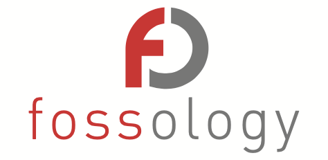
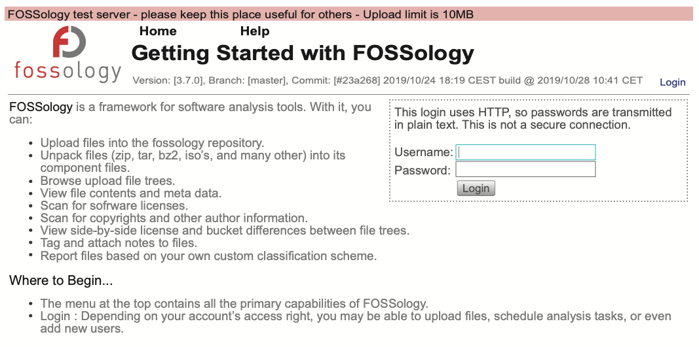

오픈소스 컴플라이언스를 위해 소프트웨어 내에 포함된 오픈소스와 라이선스 정보를 검출하기 위해 소스코드 스캔 도구를 사용할 수 있다. 



_<center>< https://www.fossology.org/ ></center>_

Linux Foundation의 FOSSology 프로젝트는 이러한 스캔 도구를 개발하고 오픈소스로 공개해 누구나 자유롭게 사용할 수 있게 한 도구이다.

## 주요 특징

FOSSology는 웹기반의 프로그램으로 사용자는 웹사이트에 로그인하여 개별 파일 혹은 소프트웨어 패키지를 업로드할 수 있다. FOSSology는 업로드된 파일 내에 라이선스 텍스트와 Copyright 정보를 검출한다. 개발자는 사용하고자 하는 오픈소스의 라이선스가 무엇인지, Copyright은 어떻게 되는지에 대한 정보를 확인하고자 할때 FOSSology를 이용하는 것이 좋다. FOSSology는 개발자가 업로드한 오픈소스 패키지 내의 모든 파일을 스캔하여 각 파일 내 라이선스 관련 텍스트와 Copyright 정보를 자동으로 검출하고, 이를 리포트로 생성한다. FOSSology 주요 특징에 대한 자세한 내용은 다음 페이지를 참고할 수 있다. : [https://www.fossology.org/features/](https://www.fossology.org/features/)

## 설치

기업 내에서 FOSSology를 사용하기 위해서는 사내에 FOSSology 서버를 구축해야 한다. 이를 위해 리눅스 기반의 서버 시스템에 FOSSology를 설치해야 한다. FOSSology는 다음 세 가지 방법으로 설치할 수 있다.

1. Docker 사용
2. Vagrant와 VirtualBox 사용 
3. Source build하여 설치

여기서는 가장 간편한 방법인 Docker를 사용하는 방법에 대해 설명한다.

FOSSology는 컨테이너화 된 Docker 이미지를 Docker Hub \(https://hub.docker.com/\)를 통해 공개하고 있다. : [https://hub.docker.com/r/fossology/fossology](https://hub.docker.com/r/fossology/fossology)

Pre-built 된 Docker 이미지는 다음 명령어를 사용하여 실행할 수 있다.

```text
$ docker run -p 8081:80 fossology/fossology
```

Docker 이미지는 다음 URL과 계정 정보로 사용할 수 있다. : http://\[IP\_OF\_DOCKER\_HOST\]:8081/repo

* Username : fossy
* Passwd : fossy

설치와 관련한 자세한 내용은 다음 페이지를 참고할 수 있다. : [https://github.com/fossology/fossology/blob/master/README.md](https://github.com/fossology/fossology/blob/master/README.md)

## 테스트 서버

FOSSology를 설치할 수 있는 시스템 구축이 곤란한 상황이라면, FOSSology Project에서 제공하는 테스트 서버를 이용할 수 있다. FOSSology 프로젝트에서는 테스트를 위한 환경을 제공한다. \(테스트 서버는 예고없이 중단될 수 있다.\) 

사용자는 다음 계정으로 FOSSology 테스트 서버에 접속하여 FOSSology 기능을 시험해볼 수 있다.


테스트 서버 URL: [https://fossology.osuosl.org/](https://fossology.osuosl.org/)

* Username: fossy
* Password: fossy




## Basic Workflow

FOSSology의 기본 사용 절차는 다음과 같다. 

* 사용하고자 하는 오픈소스의 라이선스와 Copyright 정보를 확인하기 위해 오픈소스의 소스 코드를 하나의 파일로 압축하여 FOSSology에 업로드한다. 
* 이를 위해 메뉴 &gt; Upload &gt; From File을 선택합니다. 


* 업로드할 파일을 선택하고 Upload 버튼을 클릭한다. 
* 업로드가 완료되면 Job Agent에 의해 자동으로 분석을 수행한다. 
* 메뉴 &gt; Jobs &gt; My Recent Jobs에서 분석 중인 Status를 확인할 수 있다. 


* 분석이 완료되면 메뉴 &gt; Browse에서 분석 결과를 확인할 수 있다.


* 개별 파일을 선택하면 FOSSology가 검출한 라이선스 관련 텍스트가 무엇인지 확인할 수 있다.


* 메뉴 &gt; Browser &gt; 파일 혹은 디렉터리를 선택 &gt;  Copyright/Email/Url/Author에서는 FOSSology가 검출한 Copyright/Email/Url/Author 정보를 보여다.


사용자는 FOSSology는 이렇게 분석한 결과가 유효한지 여부에 대해 확인 후 잘못 검출된 항목에 대해서는 분석 결과에서 제외시키는 작업을 할 수 있다. FOSSology는 이를 Clearing 과정이라고 설명하며, 자세한 사항은 다음 페이지를 참고할 수 있다. : [https://www.fossology.org/get-started/basic-workflow/](https://www.fossology.org/get-started/basic-workflow/)

위와 같은 방법으로 사용하고자 하는 오픈소스의 라이선스는 무엇인지, Copyright 정보는 어떻게 되는지를 간단히 확인할 수 있다.

